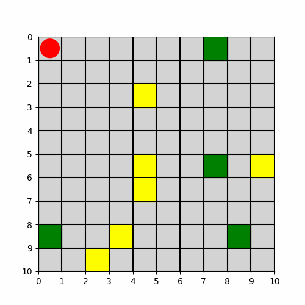

# 🚗 Smart Parking Lot Agent 🅿️  

## 📌 Project Overview  
This project implements a **reinforcement learning agent** to navigate a simulated **parking lot environment** and efficiently find an available parking spot. The environment is structured as a **2D grid**, with randomly placed parking spots, some of which are occupied. The agent is trained using **Q-learning** to minimize steps and maximize efficiency.

## 🎯 Goal  
Train an autonomous agent to:  
✅ Find a free parking spot as quickly as possible.   
⚡ Learn an **optimal policy** through reinforcement learning.  

---

## 📦 Environment  

### 📍 Grid World Representation  
The parking lot is a **grid-based world**, where each cell represents:  
- 🟩 **Empty Space** – The agent can move through it freely.  
- 🅿️ **Parking Spot** – Can be either **available (1)** or **occupied (2)**.   
- 🚗 **Agent** – The car's current location.  

### 📏 Grid Size  
- Default: **10×10** (can be adjusted).  
- Parking spots are randomly assigned.  
- Occupied spots are set based on an **occupancy ratio (default 60%)**.  
- The agent **always starts at the entrance (top-left corner)**.  

### 🎲 Randomized Spot Placement  
- Each episode starts with **randomly placed parking spots**.  
- A percentage of spots are **marked as occupied**, making the problem dynamic.  

---

## 🤖 Agent  

### 🔀 Actions  
The agent can take **one of four actions**:  
⬆️ **Move Up** | ⬇️ **Move Down** | ⬅️ **Move Left** | ➡️ **Move Right**  

### 📊 State Representation  
The environment returns **only the agent’s coordinates** as the state:  
```python
# Updated env.reset():
return self.agent_pos

# Updated env.step():
return self.agent_pos, reward, done, {}
```
Three possible **state representations**:  
1. **Full Grid View** – The entire grid as input (simpler but less scalable).  
2. **Local View** – A **3×3** or **5×5** window centered on the agent (better scalability).  
3. **Distance Sensors** – Distance to **walls, parking spots, and obstacles**.  

---

## 🏆 Rewards System  
| Event | Reward |
|------|--------|
| ✅ Successfully parking in an **available spot** | **+100** |
| ➡️ Each move | **-1** (encourages efficiency) |
| 🚫 Trying to park in an **occupied spot** | **-50** |
| ❌ Max steps reached without parking | **-10** |


## 🚀 Q-Learning Agent  

### 📖 Learning Process  
The agent uses **Q-learning**, a reinforcement learning algorithm that updates a **Q-table** to estimate the best action for each state.  

$$ Q(s, a) = Q(s, a) + α * (r + γ * max(Q(s', a')) - Q(s, a)) $$

where:  
- **s** = Current state  
- **a** = Action taken  
- **r** = Reward received  
- **s'** = Next state  
- **α (learning rate)** = 0.1  
- **γ (discount factor)** = 0.9  

### 🔄 Exploration vs. Exploitation  
- Starts with **high exploration (ε = 1.0)**.  
- Gradually **decays exploration** using an exponential decay function:

$$
ε = ε_{min} + (ε_{max} - ε_{min}) × e^{-	ext{decay rate} × 	ext{episode}}
$$


## 📊 Training the Agent  
To train the agent, run:  
```python
env = ParkingLotEnv()
agent = ParkingLotAgent(env, exploration_rate=1.0, decay_exploration=True)

train_agent(env, agent, num_episodes=5000)
```

### 🏁 Training Progress  
A **reward plot** visualizes the learning progress:  
```python
plt.plot(rewards)
plt.xlabel("Episode")
plt.ylabel("Total Reward")
plt.title("Training Progress")
plt.show()
```

---

## 🤖 SARSA Agent  

SARSA (State-Action-Reward-State-Action) is another reinforcement learning algorithm that follows an **on-policy** strategy. Unlike Q-learning, SARSA updates its Q-values using the next action that was actually chosen by the agent, rather than assuming the best possible action. The update rule is:

$$ Q(s, a) = Q(s, a) + α * (r + γ * Q(s', a') - Q(s, a)) $$

where:
- **a'** is the action actually taken in the next state.
- This makes SARSA more conservative than Q-learning in some cases.

## 🎲 Random Walk Strategy  
A baseline **random strategy** is implemented where the agent takes completely random actions without learning. This is useful for comparing against **reinforcement learning approaches** to measure their efficiency and improvements over time.

---

## 📊 Performance & Visualization  

### Random walk agent



### SARSA


### Q-Learning


---

## 🔧 Installation & Usage  
Clone the repository:  
```bash
git clone https://github.com/yourusername/smart-parking-lot-agent.git
cd smart-parking-lot-agent
```
Install dependencies:  
```bash
pip install -r requirements.txt
```
Run the script:  
```bash
python RL_игра-3.ipynb
```
---

## 🛠 Tech Stack  
- **Python**  
- **OpenAI Gym (for custom environment)**  
- **NumPy & Matplotlib (for analysis & visualization)**  
- **Q-learning & SARSA (Reinforcement Learning)**  

---

## 📢 Contributions  
🚀 Feel free to fork, open issues, or submit PRs!  
